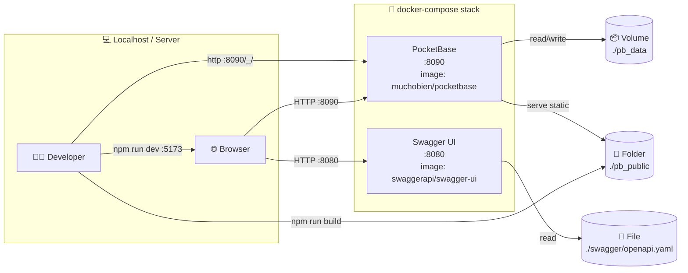
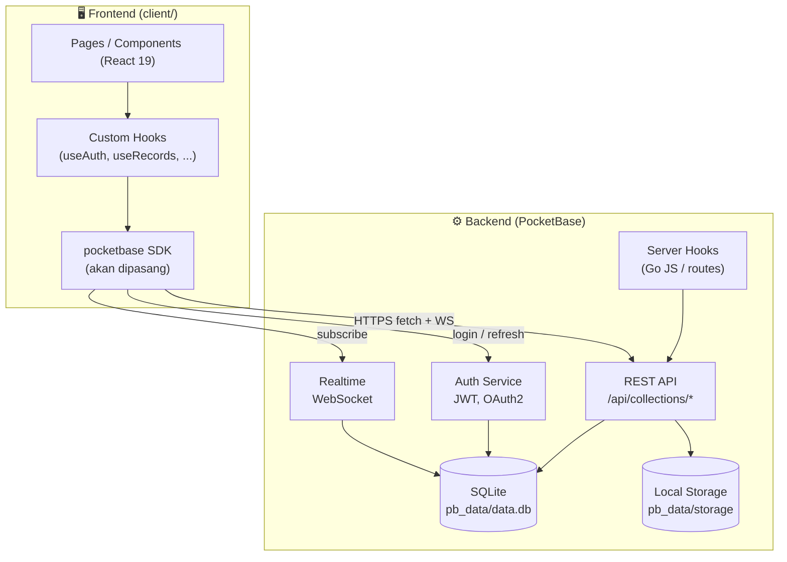
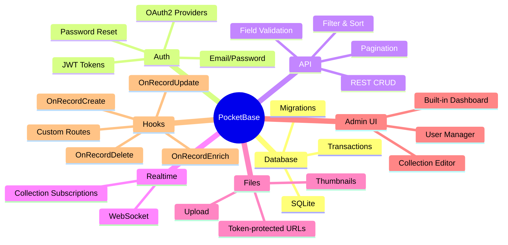
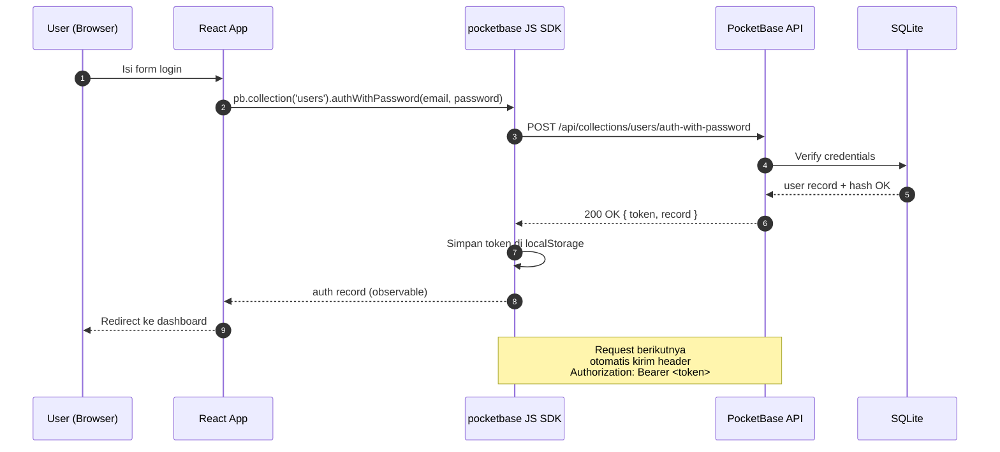
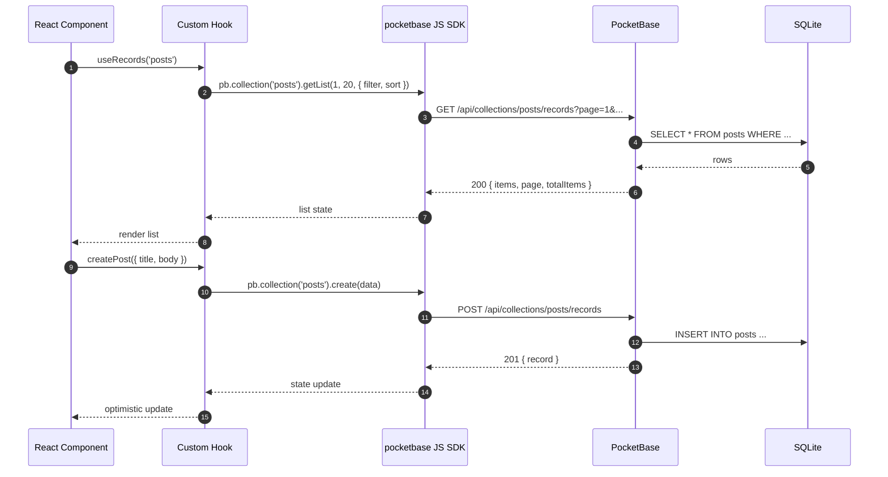
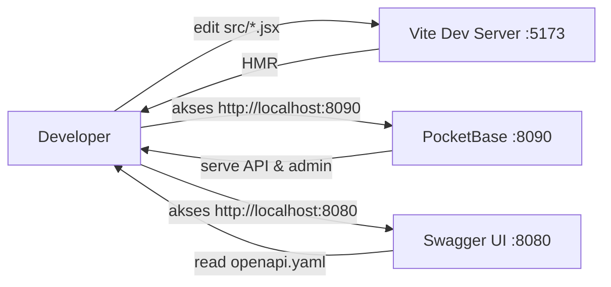
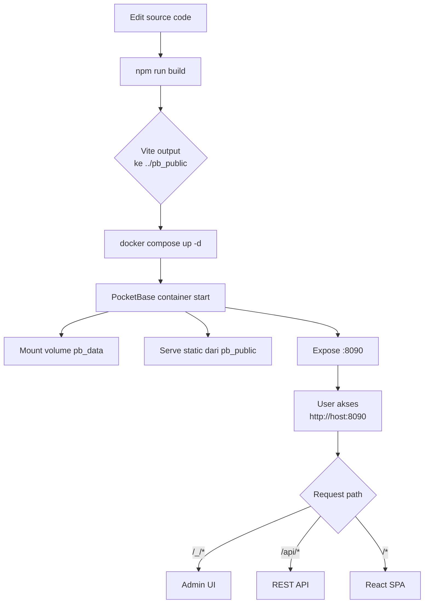
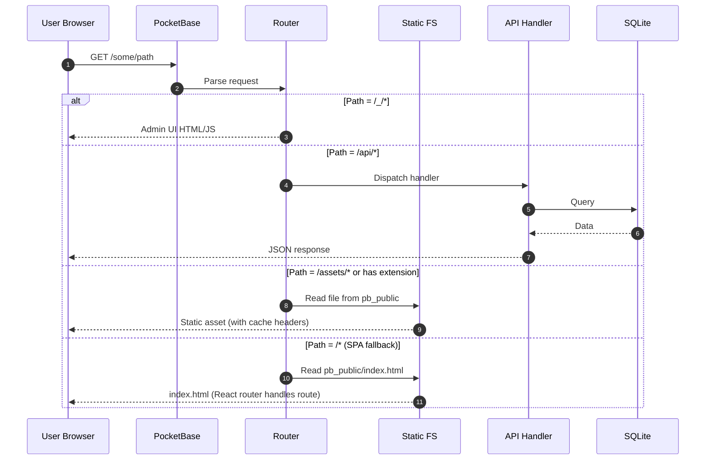
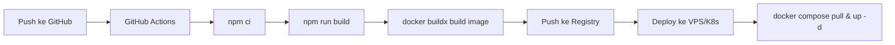

# PocketBase + React (Vite) Starter

> Monorepo ringan berisi **PocketBase** sebagai backend (database, auth, file storage, dan static file server) dan **React 19 + Vite 8** sebagai frontend. Frontend di-*build* langsung ke folder yang disajikan oleh PocketBase, sehingga hasil build dapat didistribusikan sebagai satu aplikasi utuh.

---

## 📑 Daftar Isi

1. [Gambaran Umum](#-gambaran-umum)
2. [Arsitektur Sistem](#-arsitektur-sistem)
3. [Tech Stack](#-tech-stack)
4. [Struktur Direktori](#-struktur-direktori)
5. [Konsep Inti](#-konsep-inti)
6. [Diagram Alur](#-diagram-alur)
7. [Quick Start](#-quick-start)
8. [Konfigurasi & Environment](#-konfigurasi--environment)
9. [API Reference](#-api-reference)
10. [Build & Deployment](#-build--deployment)
11. [Skrip NPM](#-skrip-npm)
12. [Troubleshooting](#-troubleshooting)
13. [Roadmap & Ide Pengembangan](#-roadmap--ide-pengembangan)

---

## 🧭 Gambaran Umum

Project ini menerapkan pola **"BaaS + SPA monolith"**:

- **PocketBase** (single binary, ditulis dalam Go) bertindak sebagai:
  - **REST API server** di `/api/*` (collections, auth, files, hooks, dll.)
  - **Realtime WebSocket** di `/api/realtime`
  - **Static file server** untuk folder `pb_public/`
  - **Admin UI** bawaan di `/_/`
- **React** (Vite) di-*build* ke `pb_public/`, sehingga PocketBase menyajikan UI dan API dalam satu origin (menghilangkan masalah CORS & cookie SameSite).

```text
┌────────────────────────────────────────────────────────────┐
│                       Browser (User)                       │
└───────────────┬────────────────────────────┬───────────────┘
                │ HTTPS / WSS                 │ HTTPS
                ▼                             ▼
   ┌──────────────────────┐       ┌──────────────────────┐
   │   PocketBase :8090   │       │   Swagger UI :8080   │
   │  ┌────────────────┐  │       │  (Dokumentasi API)   │
   │  │   /api/*       │  │       └──────────┬───────────┘
   │  │   /api/realtime│  │                  │ baca
   │  │   /_/ (admin)  │  │                  ▼
   │  │   /* (static)  │  │       ┌──────────────────────┐
   │  └────────────────┘  │       │  swagger/openapi.yaml│
   │         ▲            │       └──────────────────────┘
   │         │ baca       │
   │         ▼            │
   │   ┌────────────┐     │
   │   │ pb_public  │     │   ← output build Vite
   │   │ pb_data    │     │   ← SQLite + uploads
   │   └────────────┘     │
   └──────────────────────┘
```

---

## 🏛 Arsitektur Sistem

### Arsitektur Container (Docker Compose)



### Arsitektur Aplikasi (Lapisan)



---

## 🧰 Tech Stack

| Layer        | Teknologi                            | Versi   | Catatan                                    |
|--------------|--------------------------------------|---------|--------------------------------------------|
| Backend      | PocketBase (`muchobien/pocketbase`)  | latest  | BaaS Go-based, SQLite bawaan              |
| API Docs     | Swagger UI                           | latest  | Spesifikasi OpenAPI 3.0                    |
| Frontend     | React                                | 19.2    | SPA dengan Hooks + StrictMode              |
| Bundler      | Vite                                 | 8.0     | HMR cepat, build output ke `pb_public`     |
| Lint         | ESLint                               | 10.3    | Flat config + plugin React Hooks/Refresh   |
| Container    | Docker Compose                       | 3.7     | 2 services: pocketbase, swagger-ui         |
| Bahasa       | JavaScript (ESM)                     | -       | Bisa migrasi ke TypeScript kapan saja      |

> **Catatan**: image `ghcr.io/muchobien/pocketbase` adalah build komunitas yang menambahkan fitur tambahan di atas PocketBase resmi (mis. extra hooks/migrations helper). Cek [repo upstream](https://github.com/muchobien/pocketbase) untuk detail fitur.

---

## 📂 Struktur Direktori

```text
pocketbase/
├── docker-compose.yml          # Orkestrasi 2 service (PocketBase + Swagger UI)
├── README.md                   # ← Anda di sini
│
├── client/                     # 🌐 Frontend React + Vite
│   ├── public/                 # Aset statis publik (di-copy saat build)
│   │   ├── favicon.svg
│   │   └── icons.svg
│   ├── src/
│   │   ├── assets/             # Gambar, logo (di-bundle)
│   │   │   ├── hero.png
│   │   │   ├── react.svg
│   │   │   └── vite.svg
│   │   ├── App.css
│   │   ├── App.jsx             # Root component
│   │   ├── index.css
│   │   └── main.jsx            # Entry point
│   ├── .gitignore
│   ├── eslint.config.js
│   ├── index.html              # Template HTML Vite
│   ├── package.json
│   ├── package-lock.json
│   └── vite.config.js          # 👈 build.outDir = ../pb_public
│
├── pb_public/                  # 📦 Output build Vite (disajikan PocketBase)
│   ├── assets/                 # JS & CSS ter-hash
│   │   ├── index-*.css
│   │   ├── index-*.js
│   │   ├── hero-*.png
│   │   ├── react-*.svg
│   │   └── vite-*.svg
│   ├── favicon.svg
│   ├── icons.svg
│   └── index.html
│
└── swagger/
    └── openapi.yaml            # Spesifikasi OpenAPI 3.0 (untuk Swagger UI)
```

### Detail Penting

- **`pb_public/`** dihasilkan oleh Vite (`vite.config.js` ⇒ `build.outDir = "../pb_public"`). Folder ini **dienerate otomatis** dan disajikan sebagai static site oleh PocketBase.
- **`pb_data/`** (tidak ada di Git) akan dibuat otomatis oleh container PocketBase pada startup pertama. Berisi `data.db` (SQLite) dan folder `storage/`.
- **`swagger/openapi.yaml`** di-mount ke Swagger UI container sehingga dokumentasi API bisa dilihat di `http://localhost:8080`.

---

## 💡 Konsep Inti

### 1. PocketBase sebagai Backend-as-a-Service

PocketBase menyatukan beberapa layanan dalam satu binary Go:



### 2. Collections (Tabel/Model)

PocketBase menyimpan data dalam **collections** (setara "tabel"). Dua jenis collection:

| Jenis         | Contoh                        | Bisa diautentikasi? |
|---------------|-------------------------------|---------------------|
| **Base**      | `posts`, `products`, `todos`  | Tidak               |
| **Auth**      | `users`, `admins`             | Ya (ada field auth) |

> Collection `users` (auth) sudah ada secara default; collection `admins` hanya untuk administrator.

### 3. Authentication Flow



### 4. Data Flow CRUD



### 5. Single-Origin Pattern (Penting!)

Karena `pb_public/` disajikan oleh PocketBase itu sendiri pada **origin yang sama** dengan API:

```text
https://app.example.com/             ← index.html (React)
https://app.example.com/assets/...   ← JS/CSS/image (static)
https://app.example.com/api/...      ← REST API
https://app.example.com/api/realtime ← WebSocket
```

**Keuntungan:**
- ✅ Tidak ada CORS (cross-origin) issue
- ✅ Cookie auth bisa pakai `SameSite=Lax` default
- ✅ Satu domain untuk deploy (lebih mudah cache/CDN)
- ✅ WebSocket aman di balik TLS yang sama

### 6. Enkripsi Field (PB_ENCRYPTION_KEY)

`docker-compose.yml` mengoper flag `--encryptionEnv=PB_ENCRYPTION_KEY`. Ini memungkinkan field tertentu ditandai **encrypted** di schema collection, sehingga data di-rest (saat dicek dari raw SQLite) tidak terbaca. Cocok untuk data sensitif (PII, token API, dsb.).

---

## 🔁 Diagram Alur

### Alur Development (lokal)



### Alur Production (build & deploy)



### Request Lifecycle



---

## 🚀 Quick Start

### Prasyarat

- **Docker** & **Docker Compose** (untuk backend)
- **Node.js ≥ 20** & **npm** (untuk frontend)
- Port `8090`, `8080`, dan `5173` (dev) tersedia

### 1. Clone & masuk folder

```bash
git clone <repo-url> pocketbase
cd pocketbase
```

### 2. Jalankan backend (PocketBase + Swagger UI)

```bash
docker compose up -d
```

Verifikasi:

| URL                                          | Kegunaan                |
|----------------------------------------------|-------------------------|
| <http://localhost:8090/_/>                   | PocketBase Admin UI     |
| <http://localhost:8090/api/health>           | Health check            |
| <http://localhost:8080>                      | Swagger UI dokumentasi  |

Pada kunjungan pertama ke `/_/`, Anda akan diminta membuat akun **admin**.

### 3. Jalankan frontend (mode development)

```bash
cd client
npm install
npm run dev
```

Buka <http://localhost:5173>. Vite otomatis mem-forward `/api` ke `http://localhost:8090` jika dikonfigurasi (lihat bagian *Proxy* di bawah).

### 4. Build untuk production

```bash
cd client
npm run build
# output tersimpan di ../pb_public
```

Setelah itu, Anda bisa langsung刷新 halaman di `http://localhost:8090` dan akan melihat aplikasi React hasil build.

---

## ⚙️ Konfigurasi & Environment

### Environment Variables

| Variable              | Default              | Wajib | Deskripsi                                                                 |
|-----------------------|----------------------|-------|---------------------------------------------------------------------------|
| `PB_ENCRYPTION_KEY`   | `""` (kosong)        | ❌    | Kunci 32-char untuk field-level encryption. **Disarankan** diisi saat production. |

Cara set:

```bash
# di .env (opsional, lalu reference di docker-compose)
PB_ENCRYPTION_KEY=please-generate-32-random-chars-xx
```

Generate kunci random:

```bash
openssl rand -hex 16
# atau
node -e "console.log(require('crypto').randomBytes(16).toString('hex'))"
```

### Volume & Mount

| Host path                | Container path        | Mode   | Tujuan                       |
|--------------------------|-----------------------|--------|------------------------------|
| `./pb_data`              | `/pb_data`            | rw     | SQLite + upload storage      |
| `./pb_public`            | `/pb_public`          | rw     | Static site (output Vite)    |
| `./swagger/openapi.yaml` | `/usr/share/nginx/html/openapi.yaml` | ro | Spesifikasi API |

> Folder `pb_data` **tidak** ada di Git. Akan dibuat otomatis oleh container.

### Port Mapping

| Service      | Container Port | Host Port | URL                       |
|--------------|----------------|-----------|---------------------------|
| PocketBase   | 8090           | 8090      | `http://localhost:8090`   |
| Swagger UI   | 8080           | 8080      | `http://localhost:8080`   |

### Vite Dev Server (opsional: tambahkan proxy)

Untuk kenyamanan dev, tambahkan proxy `/api` di `client/vite.config.js`:

```js
import { defineConfig } from 'vite'
import react from '@vitejs/plugin-react'

export default defineConfig({
  plugins: [react()],
  build: {
    outDir: '../pb_public',
    emptyOutDir: true,
  },
  server: {
    port: 5173,
    proxy: {
      '/api': {
        target: 'http://localhost:8090',
        changeOrigin: true,
      },
      '/_/': {
        target: 'http://localhost:8090',
        changeOrigin: true,
        rewrite: (p) => p.replace(/^\/_/, '/_'),
      },
    },
  },
})
```

Dengan ini, kode Anda cukup pakai `pb.baseURL` default (relative) dan otomatis mengarah ke backend di dev maupun prod.

## 🗄️ Manajemen Database & Migrasi

PocketBase mendukung penulisan migrasi skema database menggunakan file JavaScript (`.js`). Dengan arsitektur Docker Compose ini, Anda cukup membuat file migrasi dan melakukan restart *container* untuk menerapkannya secara otomatis.

### 1. Cara Membuat File Migrasi
Buat file baru di dalam direktori `pb_migrations/` menggunakan prefix *timestamp* Unix (contoh: `1718714880_nama_migrasi.js`).

### 2. Sintaks Dasar Migrasi (PocketBase v0.23+)
Berikut adalah contoh struktur script untuk membuat *collection* baru beserta relasi:

```javascript
migrate((app) => {
  // --- Membuat Collection Baru ---
  const myCollection = new Collection({
    id: "random_id_bebas_123",
    name: "nama_koleksi",
    type: "base",
    fields: [
      {
        name: "id",
        type: "text",
        primaryKey: true,
        required: true,
        system: true
      },
      {
        name: "judul",
        type: "text",
        required: true,
      },
      {
        name: "user",
        type: "relation",
        required: true,
        collectionId: "_pb_users_auth_", // ID tabel user bawaan
        maxSelect: 1
      }
    ],
    // Aturan Akses (API Rules)
    listRule: "@request.auth.id != ''", // Hanya user login
    viewRule: "@request.auth.id != ''",
    createRule: "@request.auth.id != ''",
    updateRule: "@request.auth.id = user", // Hanya si pemilik relasi
    deleteRule: "@request.auth.id = user"
  });

  app.save(myCollection);
  
}, (app) => {
  // --- Rollback / Undo (dieksekusi saat pocketbase migrate down) ---
  const myCollection = app.findCollectionByNameOrId("nama_koleksi");
  if (myCollection) {
    app.delete(myCollection);
  }
});
```

### 3. Cara Menjalankan Migrasi
Karena opsi `--migrationsDir=/pb_migrations` sudah disetel dan fitur Automigrate hidup secara *default*, Anda **hanya perlu me-restart container** agar PocketBase memindai dan menjalankan migrasi baru:

```bash
docker compose restart pocketbase
```

PocketBase akan mencatat file mana yang sudah dieksekusi di tabel internal SQLite, sehingga file yang sama tidak akan dieksekusi dua kali.

---

## 📚 API Reference

PocketBase mengekspos REST API di bawah `/api/`. Endpoint utama:

| Method | Path                                                      | Deskripsi                              |
|--------|-----------------------------------------------------------|----------------------------------------|
| GET    | `/api/health`                                             | Health check (public)                  |
| GET    | `/api/collections`                                        | Daftar semua collections (auth)        |
| GET    | `/api/collections/{collection}/records`                   | List records (filter, sort, paginate)  |
| GET    | `/api/collections/{collection}/records/{id}`              | Get one record                         |
| POST   | `/api/collections/{collection}/records`                   | Create record                          |
| PATCH  | `/api/collections/{collection}/records/{id}`              | Update record                          |
| DELETE | `/api/collections/{collection}/records/{id}`              | Delete record                          |
| POST   | `/api/collections/{collection}/auth-with-password`        | Login email/password                   |
| POST   | `/api/collections/{collection}/auth-refresh`              | Refresh JWT                            |
| POST   | `/api/admins/auth-with-password`                          | Login admin                            |
| GET    | `/api/files/{collection}/{recordId}/{filename}`            | Download file                          |
| WS     | `/api/realtime`                                           | Subscribe perubahan collection         |

> Definisi lengkap bisa dilihat di Swagger UI: <http://localhost:8080>.
> Spesifikasi mentah: `swagger/openapi.yaml` (edit sesuai koleksi Anda).

### Contoh: List & Filter

```bash
# List posts, urut terbaru, hanya yang published
curl "http://localhost:8090/api/collections/posts/records?filter=published%3Dtrue&sort=-created&page=1&perPage=20"

# Buat record baru
curl -X POST http://localhost:8090/api/collections/posts/records \
  -H "Content-Type: application/json" \
  -d '{"title":"Hello","body":"World","published":true}'
```

### Sintaks Filter

```text
title = "hello"          # equality
title != "hello"
title ~ "hel"           # contains (LIKE %hel%)
title !~ "hel"
created >= "2025-01-01"
views > 100
author.name = "budi"    # relasi
status = "draft" || status = "review"
```

### Sintaks Sort

```text
-created                  # DESC by created
created,title             # ASC by created, then title
-author.name              # DESC by relation field
```

---

## 📦 Build & Deployment

### Build Lokal

```bash
cd client
npm run build
# → ../pb_public/ siap di-serve
```

### Deploy Single-Container

PocketBase sudah berisi static site, jadi deployment cukup **1 binary + 1 folder**:

```text
dist/
├── pocketbase          # binary
├── pb_data/            # SQLite + uploads
└── pb_public/          # hasil build Vite
```

Jalankan:

```bash
./pocketbase serve --encryptionEnv=PB_ENCRYPTION_KEY
```

### Deploy Multi-Container (sudah dikonfigurasi)

```bash
docker compose up -d --build
```

### Tips Production

- ✅ Set `PB_ENCRYPTION_KEY` yang kuat
- ✅ Pasang reverse proxy (Caddy/Nginx/Traefik) untuk **HTTPS**
- ✅ Backup folder `pb_data` secara berkala (cukup copy file `data.db`)
- ✅ Jangan lupa exclude `pb_data/` dari Git (lihat `.gitignore` root)
- ✅ Monitor healthcheck: `GET /api/health` (sudah dikonfigurasi di compose)
- ✅ Tambahkan limit rate di reverse proxy untuk `/api/`

### CI/CD (contoh alur)



---

## 🛠 Skrip NPM

Berlaku di folder `client/`:

| Script            | Perintah           | Fungsi                                                 |
|-------------------|--------------------|--------------------------------------------------------|
| `npm run dev`     | `vite`             | Jalankan Vite dev server dengan HMR di `:5173`         |
| `npm run build`   | `vite build`       | Build produksi ke `../pb_public`                       |
| `npm run preview` | `vite preview`     | Preview hasil build (statis) di port bawaan Vite      |
| `npm run lint`    | `eslint .`         | Jalankan ESLint di semua file JS/JSX                   |

### Skrip Docker (root)

```bash
docker compose up -d          # start background
docker compose down           # stop
docker compose logs -f        # tail logs semua service
docker compose logs -f pocketbase   # tail logs PocketBase saja
docker compose restart pocketbase   # restart service tertentu
docker compose pull && docker compose up -d   # update image
```

---

## 🩺 Troubleshooting

<details>
<summary><b>❌ Terjebak di halaman Login saat instalasi pertama kali</b></summary>

Jika PocketBase mendeteksi adanya data lama di folder `pb_data`, ia tidak akan menampilkan form "Create your first admin", melainkan langsung masuk ke halaman Login standar. Jika Anda tidak memiliki kredensial admin tersebut, Anda dapat memaksa pembuatan/pengaturan ulang akun superuser melalui command line Docker dengan perintah berikut:

```bash
docker compose exec pocketbase /usr/local/bin/pocketbase superuser upsert admin@example.com password1234 --dir /pb_data
```

*(Ganti `admin@example.com` dan `password1234` dengan kredensial pilihan Anda)*

Setelah berhasil, silakan login menggunakan email dan password tersebut.
</details>

<details>
<summary><b>❌ Port 8090 sudah dipakai</b></summary>

Ubah mapping di `docker-compose.yml`:

```yaml
ports:
  - "9090:8090"   # host:container
```

</details>

<details>
<summary><b>❌ PocketBase tidak bisa baca <code>pb_public</code></b></summary>

Pastikan folder ada dan berisi `index.html`:

```bash
ls pb_public/index.html
```

Jika belum, jalankan `npm run build` di `client/`.

</details>

<details>
<summary><b>❌ React dev server tidak bisa hit API (CORS)</b></summary>

Tambahkan proxy di `client/vite.config.js` (lihat bagian *Vite Dev Server* di atas).

</details>

<details>
<summary><b>❌ Lupa password admin PocketBase</b></summary>

Hapus akun admin lama via shell SQLite, atau set ulang lewat CLI PocketBase. Lihat [dokumentasi resmi](https://pocketbase.io/docs/).

</details>

<details>
<summary><b>❌ HMR tidak bekerja setelah edit <code>vite.config.js</code></summary>

Vite perlu restart. Tekan <kbd>R</kbd> di terminal, atau `Ctrl+C` lalu `npm run dev` lagi.

</details>

<details>
<summary><b>❌ Build output kosong / hanya muncul 404 di <code>/</code></b></summary>

Periksa `client/vite.config.js` ⇒ `build.outDir` harus `../pb_public` (relatif dari `client/`).

</details>

---

## 🗺 Roadmap & Ide Pengembangan

- [ ] Pasang [`pocketbase`](https://github.com/pocketbase/js-sdk) JS SDK di `client/`
- [ ] Migrasi ke **TypeScript**
- [ ] Tambah **React Router** untuk multi-page
- [ ] State management: **Zustand** atau **TanStack Query**
- [ ] Tambah koleksi contoh: `posts`, `todos`, `profiles`
- [ ] Implementasi **OAuth2** (Google/GitHub) via PocketBase
- [ ] **Realtime** subscription untuk live-update list
- [ ] **CI/CD** GitHub Actions untuk build & deploy otomatis
- [ ] **Backup script** terjadwal untuk `pb_data/`
- [ ] Dockerfile untuk custom PocketBase image dengan hooks Go

---

## 📜 Lisensi & Kredit

- [PocketBase](https://pocketbase.io/) — MIT License
- [muchobien/pocketbase](https://github.com/muchobien/pocketbase) — image Docker yang digunakan
- [React](https://react.dev/) — MIT License
- [Vite](https://vite.dev/) — MIT License
- [Swagger UI](https://swagger.io/tools/swagger-ui/) — Apache 2.0

---

## 📋 Changelog

### 2026-06-21 — Perbaikan LaporanWarga & Migrasi v0.39.x

#### 🔧 Perbaikan UI LaporanWarga
- **Bottom Sheet Modal** untuk edit status laporan (mengganti form inline)
  - Pill buttons pemilih status (Menunggu/Diproses/Selesai/Ditolak)
  - Textarea tanggapan dengan auto-focus
  - Loading spinner saat menyimpan
  - Tombol Simpan & Batal dengan touch target minimal 44px
- **Toast notification** menggantikan `alert()` — muncul dari bawah, auto-dismiss
- **Statistik** otomatis (Total / Selesai / Diproses) di atas list
- **Card redesain** dengan border-left berwarna sesuai status
- **Status badge** dengan ikon visual (✓ ⟳ ✕)
- **Image preview** full-screen dengan backdrop blur
- **Empty state** ilustrasi saat belum ada laporan

#### 🐛 Fix Critical — Data Tidak Muncul
**Masalah**: PocketBase v0.39.x tidak menyertakan field `created`/`updated` untuk base collections secara default. Ini menyebabkan:
- `sort=-created` di API mengembalikan **0 item** (field tidak dikenal)
- `item.created` bernilai `undefined` di komponen

**Perbaikan**:
- Migrasi `1782031668_updated_lapor.js` menambahkan field `created` (autodate onCreate) dan `updated` (autodate onUpdate) ke collection `lapor`
- Kode frontend menggunakan `sort=-created` dan menampilkan tanggal dengan fallback `—`

#### ⚙️ Konfigurasi Build
- `vite.config.js`: `build.outDir` diubah ke `/var/data/pocketbase/pb_public` (Docker volume)
- Build output langsung tersaji oleh PocketBase container

---

> ✨ Dibuat sebagai starter kit untuk eksplorasi **BaaS + SPA monolith**. Silakan fork, modifikasi, dan sesuaikan dengan kebutuhan Anda.
